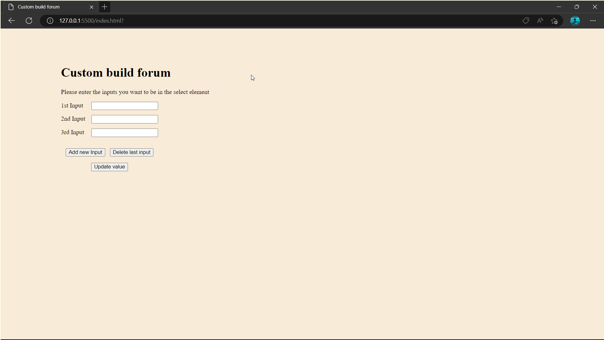

# Custom-build-form

## Requirements 

- Create a custom build form – the user can add or remove fields at will. (The fields to be added or deleted have to be of just 2 types – text & select)
- When the user saves the data from the form, all the data has to be displayed in a table.
- The table will have at the header the name of each field, for example First name, and in the first row the answers of the form submitted, for example Dimitris.

## Footage

## Features

- Check for duplication in select input.
- Add as much as 10 input for select.
- User friendly as the interface is two colours.
- Simple navigation with only keyboard (if needed).
- Front-end design is responsive as the spaces are based on the user viewport using VW and VH.
- Used only HTML, CSS and JavaScript (no visual libraries).
